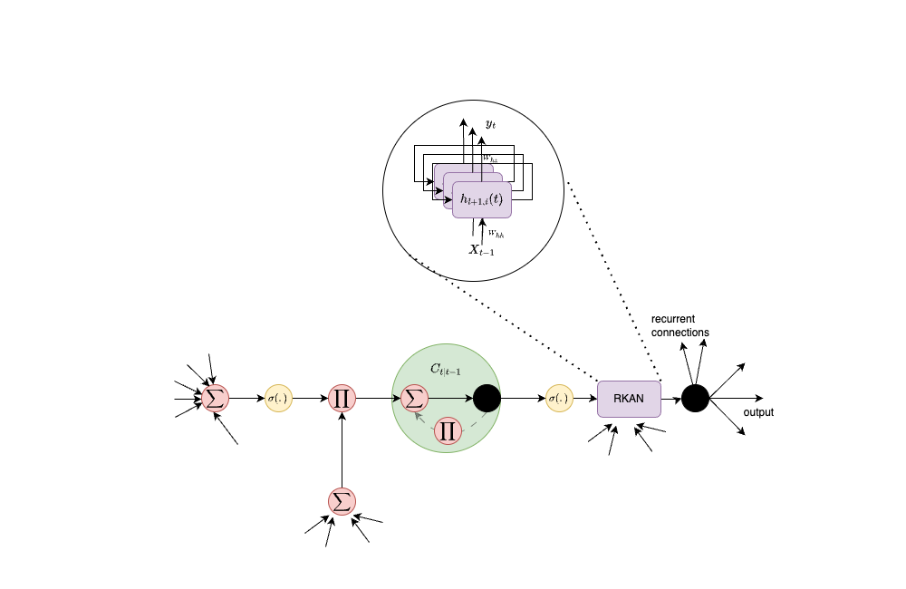

# TKAN: Temporal Kolmogorov-Arnold Networks

TKAN (Temporal Kolmogorov-Arnold Networks) is a neural network architecture designed to enhance multi-horizon time series forecasting. 
This Keras implementation integrates TKAN as a layer within sequential models, facilitating the use of advanced neural network techniques in practical applications. 
The implementation is tested to be compatatible with Tensorflow, Jax and Torch. From testing jax is the best backend in terms of performance with it, while torch is very slow (probably not well optimized for it).
It is the original implementation of the [paper](https://arxiv.org/abs/2405.07344)
The KAN part implementation has been inspired from [efficient_kan](https://github.com/Blealtan/efficient-kan), and is available [here](https://github.com/remigenet/keras_efficient_kan) and works similarly to it, thus not exactly like the [original implementation](https://github.com/KindXiaoming/pykan).

In case of performance consideration, the best setup tested used [jax docker image](https://hub.docker.com/r/bitnami/jax/) followed by installing jax using ```pip install "jax[cuda12]"```, this is what is used in the example section where you can compare the TKAN vs LSTM vs GRU time and performance.
I also discourage using as is the example for torch, it seems that currently when running test using torch backend with keras is much slower than torch directly, even for GRU or LSTM. 



## Installation

Install TKAN directly from PyPI:

```bash
pip install tkan
```

Dependencies are managed using pyproject.toml.

## Usage

TKAN can be used within TensorFlow models to handle complex sequential patterns in data.
It's implementation reproduce architecture of RNN in tensorflow with Cell class and Layer that inherits from RNN in order to provide a perfect integrations with tensorflow.
Here is an example that demonstrates how to use TKAN in a sequential model:

```python
import keras
from tkan import TKAN


# Example model using TKAN with B-spline activations
model = keras.Sequential([
      keras.layers.InputLayer(input_shape=X_train_seq.shape[1:]),
      TKAN(100, sub_kan_configs=[{'spline_order': 3, 'grid_size': 10}, {'spline_order': 1, 'grid_size': 5}, {'spline_order': 4, 'grid_size': 6}, ], return_sequences=True, use_bias=True), #Define the params of the KANLinear as dict as here
      TKAN(100, sub_kan_configs=[1, 2, 3, 3, 4], return_sequences=True, use_bias=True), #Use float or int to specify only the exponent of the spline
      TKAN(100, sub_kan_configs=['relu', 'relu', 'relu', 'relu', 'relu'], return_sequences=True, use_bias=True), #Or use string to specify the standard tensorflow activation using Dense in sublayers instead of KANLinear
      TKAN(100, sub_kan_configs=[None for _ in range(3)], return_sequences=False, use_bias=True), # Or put None for default activation
      keras.layers.Dense(y_train_seq.shape[1]),
])
```

You can find a more complete example with comparison with other models in the example folder.

Please cite our work if you use this repo:

```
@article{genet2024tkan,
  title={Tkan: Temporal kolmogorov-arnold networks},
  author={Genet, Remi and Inzirillo, Hugo},
  journal={arXiv preprint arXiv:2405.07344},
  year={2024}
}
```

Shield: [![CC BY-NC-SA 4.0][cc-by-nc-sa-shield]][cc-by-nc-sa]

This work is licensed under a
[Creative Commons Attribution-NonCommercial-ShareAlike 4.0 International License][cc-by-nc-sa].

[![CC BY-NC-SA 4.0][cc-by-nc-sa-image]][cc-by-nc-sa]

[cc-by-nc-sa]: http://creativecommons.org/licenses/by-nc-sa/4.0/
[cc-by-nc-sa-image]: https://licensebuttons.net/l/by-nc-sa/4.0/88x31.png
[cc-by-nc-sa-shield]: https://img.shields.io/badge/License-CC%20BY--NC--SA%204.0-lightgrey.svg
